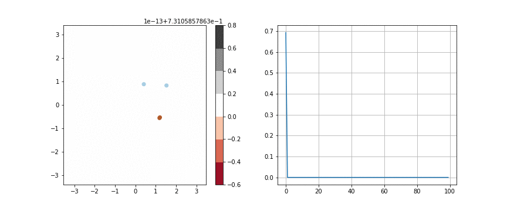
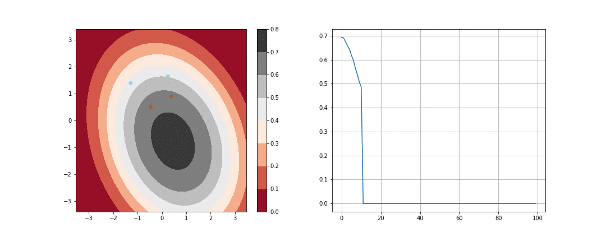

# Visualizing the Comparitive Performance of Optimizers
This is a repo illustrating comparitive study of various optimizers available in Pytorch and Tensorflow. The Code here runs on Tf 1.2. Soon the code will be migrated to Tf 2.x and Pytorch.

The acclaimed function ASMGrad didn't perform better the traditional Adam. SGD with Momentum and Adam with Randomized Learning Rate provide best solution for this study.

## Findings : SGD is time tested solution for convergence. Adam's generalization after steep convergence aren't great. ASM Grad performance wasnot upto the standard as projected.

## The results can be replicated by using the notebook. Changing data and other hyper parameters can alternate the results obtained.

## Mini Batch Stochastic Gradient Descent
It worked great and converged far better than most of the optimizers.

## SGD with Momentum
One of the time tested optimizer

## SGD with Nesterov Momentum
Comparable results to the above optimizer.

## RMSprop

## Adam Lr 0.001

## Adam Lr 0.0001

## Adam with Monotonic Decreasing Lr from 0.01 to 0.00001

## Adam with Randomised Lr from 0.01 to 0.00001 for each step

